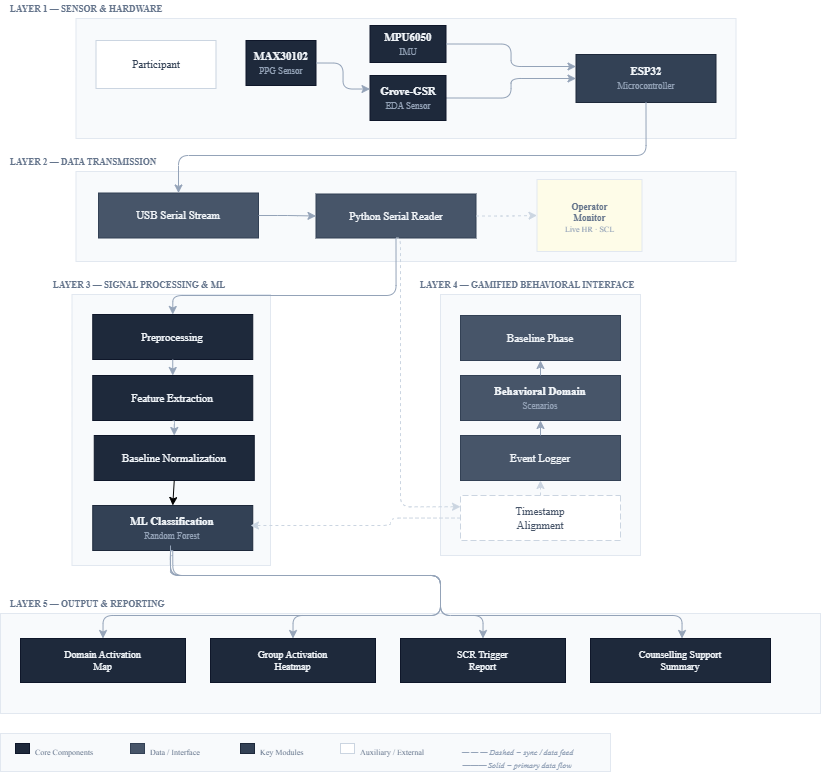

# Pulse: Gamified Physiological Activation Mapping System

Engineering research prototype mapping autonomic stress activation across seven behavioral domains in young adults (15–25 years) using wearable PPG + GSR sensors integrated with a gamified simulation interface.

---

## Goal

Design and validate a domain-based interactive simulation framework that maps autonomic physiological responses (HRV + EDA) to structured behavioral contexts — without diagnosing or labeling individuals. Output is a domain-level activation map per subject, plus event-aligned physiological trigger flags during gamified scenarios.

---

## Current Status

Phase 1 (WESAD software pipeline) is complete. `wesad_loader.py` loads and label-aligns raw WESAD subject data. `preprocess.py` cleans BVP via bandpass filtering and peak detection with IBI outlier correction, and decomposes EDA into tonic (SCL) and phasic (SCR) components. `features.py` extracts a 9-feature vector (HR, RMSSD, SDNN, pNN50, SCR count/amplitude/energy/energy-per-peak, SCL mean) over 60s windows. `normalize.py` applies within-subject z-score normalization against each subject's own baseline. `classifier.py` trains and evaluates a Random Forest with Leave-One-Subject-Out cross-validation. `threshold_detector.py` implements real-time, non-ML event flagging (GSR and HR threshold crossing) with onset-latency validation. `run_pipeline.py` runs the full chain across all subjects in parallel. `batch_comparison.py` cross-checks feature consistency across subjects.

---

## Dataset

WESAD (Schmidt et al., 2018) — 15 subjects (S2–S11, S13–S17), wrist BVP + EDA, used as the software validation bridge until custom hardware is assembled.

---

## Pipeline Architecture

---

## Results

Random Forest, binary classification (baseline vs stress), evaluated with Leave-One-Subject-Out cross-validation across all 15 subjects (807 windows total).
 
| Metric | Value |
|---|---|
| Accuracy | 0.9591 |
| F1-macro | 0.9503 |
| Specificity | 0.9841 |
| Sensitivity | 0.9004 |