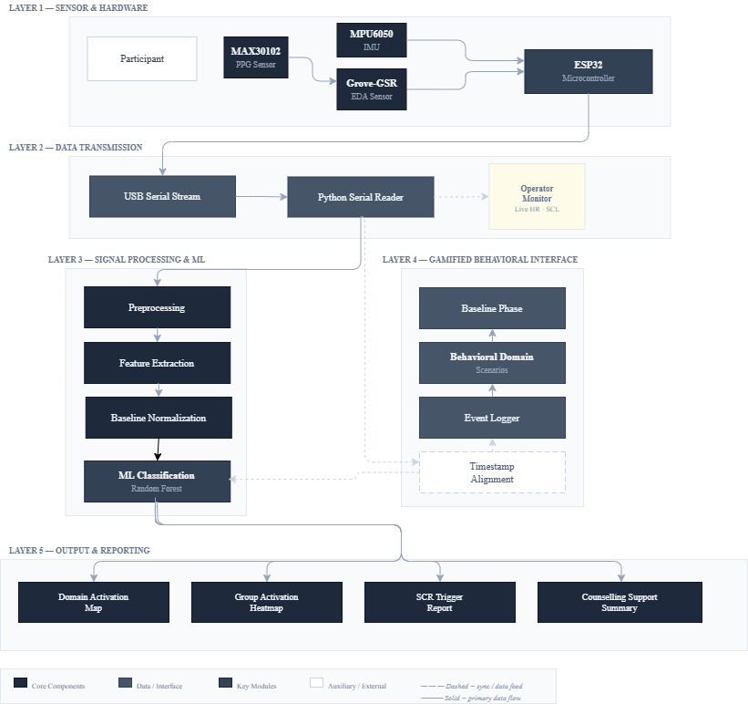

# Pulse: Gamified Physiological Activation Mapping System

Engineering research prototype mapping autonomic stress activation across seven behavioral domains in young adults (15–25 years) using wearable PPG + GSR sensors integrated with a gamified simulation interface.

---

## Goal

Design and validate a domain-based interactive simulation framework that maps autonomic physiological responses (HRV + EDA) to structured behavioral contexts — without diagnosing or labeling individuals. Output is a domain-level activation map per subject, plus event-aligned physiological trigger flags during gamified scenarios.

---

## Current Status

- **Phase 1 (WESAD software pipeline)**: Complete. `wesad_loader.py` loads raw WESAD data. `preprocess.py` filters BVP and decomposes EDA into tonic (SCL) and phasic (SCR) components. `features.py` extracts a 9-feature vector over 60s windows. `normalize.py` applies within-subject z-score normalization. `classifier.py` trains a Random Forest with Leave-One-Subject-Out cross-validation. `threshold_detector.py` implements real-time non-ML event flagging.
- **Phase 2 & Milestone M2 (Hardware Bring-Up)**: Complete. ESP32 acquisition rig verified (drop rate 0.010%, calibrated `ACC_THRESHOLD_HW = 8800.0`, valid pulse IBIs).
- **Phase 4 (Gamification Engine)**: Complete. 60 FPS state machine in Pygame implementing 7 behavioral domains and 14 scenarios (15–25 age range) with score-free narrative consequence design and host-PC `unix_ts_ms` event logging. Every scenario is one uninterrupted priming → decision → feedback epoch of at least 60 s (a keypress commits the choice; the screen holds until the timer ends), so each one contains a full HRV feature window. A sensor bridge drives the Domain 7 composure display from the ESP32, live or from a recording; it is tested against simulated ports and has not yet been run on the physical device.
- **Quality gates**: `uv run pytest` (114 tests), `uv run mypy src/ tests/ --strict` and `uv run ruff check .` are all clean across the repository.

---

## WESAD Benchmark Results

Random Forest, binary classification (baseline vs stress), evaluated with Leave-One-Subject-Out cross-validation across all 15 subjects (807 windows total).

| Metric | Value |
|---|---|
| Accuracy | 0.9591 |
| F1-macro | 0.9503 |
| Specificity | 0.9841 |
| Sensitivity | 0.9004 |

---

## Pipeline Architecture



---

## Repository Structure

```
Pulse/
├── .gitignore                            # Unified ignore rules (caches, data/, outputs/, venvs)
├── .python-version                       # Python runtime specification (3.13)
├── pyproject.toml                        # Merged dependencies (numpy, scipy, scikit-learn, neurokit2, pygame, etc.)
├── uv.lock                               # Deterministic dependency lockfile
├── README.md                             # Project overview (both tracks documented)
├── CLAUDE.md / GEMINI.md                 # AI agent rules & architecture contracts
│
├── assets/                               # [Ayush] Static media assets
│   └── audio/
│       └── tension_drone.wav             # 60–80 Hz low-frequency loop drone
│
├── data/                                 # Shared data root (gitignored)
│   ├── WESAD/                            # [Mukasshaf] Benchmark dataset (S2–S17)
│   ├── hardware/                         # [Mukasshaf] ESP32 sensor captures
│   │   ├── raw/                          # Raw CSVs from serial_reader.py
│   │   └── labeled/                      # Protocol labeled CSVs
│   └── game_logs/                        # [Ayush] Session event logs
│
├── docs/                                 # Unified documentation
│   ├── specs/                            # [Ayush] Gamification technical specifications
│   │   ├── ARCHITECTURE_SPEC.md
│   │   ├── CODING_STANDARDS_AND_RULES.md
│   │   ├── DATA_MODELS_AND_CONTRACTS.md
│   │   ├── domain_implementation_strategy.md
│   │   ├── IMPLEMENTATION_PLAN.md
│   │   └── TEST_CRITERIA_AND_EDGE_CASES.md
│   ├── guides/                           # [Mukasshaf] Hardware & validation guides
│   │   ├── PULSE_Hardware_Setup.md
│   │   ├── PULSE_M2_Validation_Guide.md
│   │   ├── PULSE_Phase3_Pipeline_Additions.md
│   │   └── PULSE_Pipeline_Change_Plan.md
│   └── interface/
│       └── PULSE_Gamification_Interface_Spec.md  # Inter-track contract
│
├── firmware/                             # [Mukasshaf] Microcontroller firmware
│   └── firmware.ino                      # ESP32 66.67 Hz sampling sketch
│
├── notebooks/                            # Exploratory Jupyter notebooks
│
├── outputs/                              # Generated run artifacts (gitignored)
│   ├── features/                         # Extracted 9-feature CSVs
│   ├── models/                           # Trained estimators (rf_loso.pkl, hw_classifier.pkl)
│   ├── plots/                            # Preprocessing & confusion matrix plots
│   └── results/                          # Fold results, transfer gap, activation maps
│
├── src/                                  # Core application source
│   ├── __init__.py
│   ├── domains.py                        # [SHARED] Single source of truth for 7 canonical domain IDs
│   ├── align_signals.py                  # [SHARED] Join script: hardware sensor CSV ↔ game events.csv
│   │
│   ├── pipeline/                         # [Mukasshaf] ML & Signal Processing Pipeline
│   │   ├── __init__.py
│   │   ├── wesad_loader.py               # WESAD pickle parser (Phase 1)
│   │   ├── hardware_loader.py            # Hardware CSV parser (HW_FS = 66.67 Hz)
│   │   ├── preprocess.py                 # BVP BPF, peak detect, EMD/SCL, motion flag (8800.0)
│   │   ├── features.py                   # 9 locked features (60s window, 30s stride)
│   │   ├── normalize.py                  # Within-subject z-score normalization
│   │   ├── classifier.py                 # Tuned Random Forest (LOSO-CV)
│   │   ├── threshold_detector.py         # Layer 1 deterministic μ+2σ rule
│   │   ├── condition_labels.py           # Protocol labels (baseline/arithmetic/stroop)
│   │   ├── condition_logger.py           # Session timer cue tool
│   │   ├── eval_zero_shot.py             # Zero-shot WESAD-to-HW evaluator
│   │   ├── train_hw_loso.py              # HW-trained LOSO classifier
│   │   ├── go_nogo_check.py              # M3 gate verification (F1-macro ≥ 0.65)
│   │   ├── batch_comparison.py           # Feature importance & comparison utility
│   │   └── run_pipeline.py               # Multi-subject batch pipeline runner
│   │
│   ├── hardware/                         # [Mukasshaf] Serial acquisition tools
│   │   ├── __init__.py
│   │   └── serial_reader.py              # Live COM reader, validates rows, injects unix_ts_ms
│   │
│   └── game/                             # [Ayush] Gamification Engine (Pygame)
│       ├── __init__.py
│       ├── main.py                       # Game CLI entry point (--subject, --bridge, --extended-rest, ...)
│       ├── engine.py                     # GameEngine: 60 FPS loop + render dispatch
│       ├── engine_state.py               # SessionConfig, state machine, transitions, exposure floors
│       ├── engine_input.py               # Keyboard / focus handling per scenario type
│       ├── engine_timer.py               # Per-frame updates, clock monitor, composure gating
│       ├── constants.py                  # Enums, timing, safety limits, paradigm parameters, palette tokens
│       ├── event_logger.py               # 9-column CSV logger (with host unix_ts_ms)
│       ├── scenarios.py                  # 14 scenarios registry (2 per domain)
│       ├── scenario_logic.py             # Adaptive MIST arithmetic, paced BART pumps, reward accumulator
│       ├── ui.py                         # UIRenderer facade (the one UI import site)
│       ├── ui_core.py                    # Fonts, text fitting, cards, palette-safe colour mixing
│       ├── ui_components.py              # Key badge, meters, compass, composure bar
│       ├── ui_screens.py                 # ID input, baseline, priming, popup, feedback, rest, debrief
│       ├── ui_post_wait.py               # Post-decision waiting screens
│       ├── ui_domains.py                 # Decision dispatch + skinless fallbacks
│       ├── ui_effects.py                 # Visual jitter (≤3px), screen vibration, color lerp
│       ├── skins/                        # 14 simulation skins, one module each
│       ├── audio.py                      # Tension drone: fade, pause/resume, volume cap
│       ├── bridge_interface.py           # BridgeInterface protocol, SensorSample, StubBridge
│       ├── sensor_stream.py              # Stream row parsing + latest-sample / motion-variance buffer
│       ├── sensor_replay.py              # ReplayBridge: replay a recording or follow a live one
│       └── sensor_bridge.py              # SerialBridge, ESP32 port detection, create_bridge()
│
├── tests/                                # Automated test suite
│   ├── __init__.py
│   ├── conftest.py                       # Shared test fixtures (mock screen, session configs)
│   │
│   ├── game/                             # [Ayush] 111 Gamification engine tests
│   │   ├── test_audio.py
│   │   ├── test_audit_fixes.py           # Exposure floors, composure gating, sensory limits
│   │   ├── test_bridge_interface.py      # Stream parser, serial / replay bridges (simulated ports)
│   │   ├── test_constants.py
│   │   ├── test_engine.py
│   │   ├── test_engine_paradigms.py      # Rest option, CLI, MIST / BART logging and indicators
│   │   ├── test_event_logger.py
│   │   ├── test_palette.py               # Ferrari tokens only, per-pixel hue audit
│   │   ├── test_scenario_logic.py
│   │   ├── test_scenarios.py
│   │   ├── test_ui.py
│   │   ├── test_ui_effects.py
│   │   └── test_ui_rules.py              # Setting labels, held state, wait copy, key prompts
│   │
│   └── pipeline/                         # [Mukasshaf] ML & Signal tests (3 placeholders)
│       ├── test_loaders.py
│       ├── test_preprocess.py
│       └── test_features.py
│
└── validation/                           # [Mukasshaf] Hardware bring-up validation
    ├── run_m2_validation.py
    ├── validate_peak_detection.py
    ├── validate_gsr_stability.py
    ├── validate_motion_flag.py
    ├── validate_drop_rate.py
    └── reports/
        ├── M2_Full_Validation_Report.md
        └── M2_Validation_Summary.md
```

---

## Quickstart

### Prerequisites
- Python 3.12+ (Python 3.13 recommended)
- Package manager: [`uv`](https://docs.astral.sh/uv/)

### Installation
```bash
uv sync
```

### Running Tests and Quality Gates
```bash
uv run pytest -v                      # 114 tests
uv run mypy src/ tests/ --strict      # strict typing, zero errors
uv run ruff check .                   # lint, zero findings
```
All three must be clean before a change is considered done.

### Running the Gamification Engine
```bash
# Full protocol. Uses the ESP32 for the Domain 7 composure display if one answers, otherwise runs without telemetry.
uv run python -m src.game.main --subject S01

# Development: 10 s baseline, windowed, no port scan
uv run python -m src.game.main --subject S01 --fast-baseline --no-fullscreen --bridge stub
```

| Option | Effect |
|---|---|
| `--subject S01` | Required. Must match `S` + 2–3 digits |
| `--fast-baseline` | 10 s baseline instead of 3 min (testing only) |
| `--no-fullscreen`, `--window-size WxH` | Windowed mode |
| `--domain <id>` | Run a single domain |
| `--extended-rest` | 60 s rest between domains instead of 30 s |
| `--bridge {auto,serial,stub,replay}` | `auto` (default): ESP32 if found, else no telemetry. `serial`: refuse to start without the ESP32. `replay`: feed from a sensor CSV. `stub`: no telemetry |
| `--bridge-port COM3` | Use this port instead of scanning |
| `--bridge-source <csv or folder>` `--bridge-follow` | With `replay`: follow the CSV that `serial_reader.py` is writing |
| `--no-exposure-floor` | Developer only: lets a keypress end a scenario early. Such sessions are not valid data |

**Recording sensors and playing at the same time.** A serial port can be opened by one program. Either let the game own it (`--bridge auto` or `serial`; it records `sensor_stream.csv` next to `events.csv`, in the same format `serial_reader.py` writes), or run `serial_reader.py` first and start the game with `--bridge replay --bridge-follow --bridge-source <its CSV>`.

Session output: `outputs/game_logs/S{id}_{timestamp}/events.csv`, `domain_order.json`, and `sensor_stream.csv` when the game owned the port. Join sensors and events afterwards with `src/align_signals.py`.

Input is keyboard only: `1`–`4` to answer, `SPACE` to start a scenario once the briefing has been on screen long enough, hold `TAB` or `Q` to re-read the briefing, `ESC` to abort.
